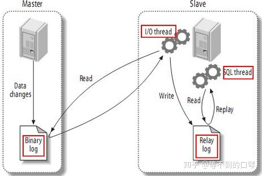
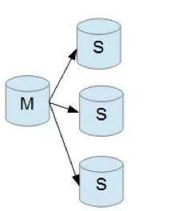
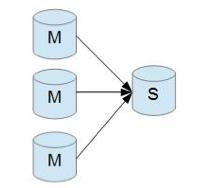
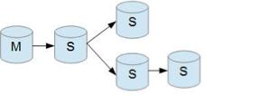

# 什麼事 Master-Slave 同步機制

## 什麼事 Master-Slave 同步機制
    就是將資料從一台 MySQL (Master) 複製資料到 一台或多台 MySQL (Slave) 的機制 (增加高可擴展性)，
    當多台 MySQL 有一樣的資料就可以解決不同場景問題，如讀的請求量很高量 可將其它 Slave MySQL 處理讀的請求、
    當 Master 發生故障時可以將 一台 Slave 提升為 Master 持續處理寫的請求 (增加高可用性)。

## 如何 Master-Slave 同步機制
    同步機制主要是用 MySQL binlog 這份檔案是同步機制的核心，檔案內容會依照同步模式如 row、statement、mixed 有不同的同步內容，
    此處是講如何做到同步就不展開同步模式的解說。

    同步流程如下
    初始化 當 Master-Slave 建立連接後，Slave 會定期收到 Master 心跳，這當中包含最新的同步資料流水號，
    Master 開啟 binlog dump 線程， Slave 會開啟兩個線程 I/O 線程、 SQL 線程。

    1. 當 Master commit 成功後寫入 binlog 此時 binlog dump 線程會讀取 binlog 並發送通知給 Slave 。
    2. Slave 的 I/O 線程接收 Master 的 binlog dump 線程的更新資料後，I/O 線程會寫入到本地的 relay log 內。
    3. SQL 線程讀取 relay log 內的資料並解析後執行操作更新 Slave 庫的資料，這樣就可達到 Master-Slave 數據一致性。

圖片截至來源[mysql主从复制原理](https://zhuanlan.zhihu.com/p/96212530)

## 什麼事 異步模式
    指的是 Master 與 Slave 資料的一致性是異步的，也就是說 Master 不會等待 Slave 執行完畢，
    而是 Master commit 後寫入資料、 binlog 後就回覆請求端結果，
    同時另一個 binlog dump 線程通知 Slave 新資料並進行寫入資料動作，如果 Master 先寫入並回應請求端，
    此時讀取 Slave 可能會是舊的資料這就是異步模式。

## 什麼事 半同步模式
    指的是 Master 與 Slave 資料的一致性做到部分同步，就是 Master 會等待 Slave commit 完成，
    但不是指所有的 Slave 而是只要有一個 Slave commit 就可以了，如果遲遲沒有 Slave 回應，
    當超過默認時間時就變回異步模式回應請求端，避免請求端一直等待到 timeout，
    此模式不能保證所有 Slave 都 commit 但會至少有一個 Slave 資料跟 Master 是一致的，
    確保資料不會遺失也不會造成執行太久問題的一個折衷方案。

## 什麼事 全同步模式
    指的是 Master 與 Slave 資料的一致性是同步的，當 Master 與 Slave 都 commit 完成，
    才會回覆請求端完成，此模式是 Master-Slave 資料的一致性是同步進行的，是用性能換取資料的一致性方案。

### 為什麼需要 Master-Slave 同步機制
    因為當 Master 不能處理操作時候，此時單個節點不能執行就會讓整個流程卡住也代表服務是不能提供功能的，
    DB 是有狀態的服務所以需要一個同步機制將資料同時傳遞到另一個節點，來確保資料是沒有遺失的，
    當有同步機制後可以解決資料遺失問題的基礎上，再去將 Slave 的角色發揮更多的功能，
    比如說提供讀的操作將 Master 讀操作資源轉移到 Slave 承擔、Slave 執行備份的作業將資料從 DB 下載放到另一台主機上做備份，
    因為備份作業執行時會消耗大量資源，並會影響讀跟寫的操作執行，讓 Slave 執行備份就不影響 Master 的運作。

## 如何做同步架構
    會依照想處理的場景來決定要不要多個 Master 增加並發寫的請求量，是不是要多從就考慮讀的請求量之外，
    包含是不是有的業務適合獨立一台 Slave 給它使用，如報表查詢這種長事務的處理，是不是要處理備份和異地備份場景，
    當判斷好要處理的場景就知道要 一主一從、一主多從、雙主複製等架構中選擇自己的方案。

## 一主一從 架構
    這是常見架構之一，多一台 Slave 可作為分擔讀的請求量，
    可處理 Master 不可用時可提升為新的 Master 繼續讓服務運行處理請求。

圖片截至來源[深度探索MySQL主从复制原理](https://zhuanlan.zhihu.com/p/50597960)

## 一主多從 架構
    跟一主一從一樣是常見的架構之一，多台 Slave 有的可作為備份機使用，有的可提供給長事務報表查詢單獨處理，
    一樣具備分擔讀請求量與可提升為新 Master 功能。

圖片截至來源[深度探索MySQL主从复制原理](https://zhuanlan.zhihu.com/p/50597960)

## 多主一從 架構
    此架構是要提高寫的請求量場景，並在 Slave 彙整所有資料可作備份、分擔讀請求的功能。

圖片截至來源[深度探索MySQL主从复制原理](https://zhuanlan.zhihu.com/p/50597960)

## 雙主複製 架構
    也是提高寫的請求量場景，雙方都是有兩個角色自己的 Master 也是對方的 Slave，
    但此架構是一個循環的關係，在做追查問題時候會增加困難度如到底資料是那台 Master 寫入。

圖片截至來源[深度探索MySQL主从复制原理](https://zhuanlan.zhihu.com/p/50597960)

## 級聯複製 架構
    此架構方案是想達到一樣一主多從的方案，但當 Master 連結越多 Slave 會耗損一部分資源在做同步複製，
    用級聯複製對 Master 只有一台 Slave 做同步複製，用 Slave 連結更多台 Slave 一樣可達到數據的複製和一致性，
    一樣增加更多台 Slave 做為備份、獨立業務使用等場景，既降低 Master 負擔也一樣有多台 Slave，
    但畢竟是一層一層傳播還是會有同步的時間差，因為 Slave 是單線程寫入而 Master 可並發寫入，
    所以有可能第二層的 Slave 會有數據延遲更久的狀況。

圖片截至來源[深度探索MySQL主从复制原理](https://zhuanlan.zhihu.com/p/50597960)

## 總結
    Master-Slave 同步機制是一個數據複製的功能，有同步機制才有辦法做到另一台節點可替換為新的 Master，
    也才有更多選擇架構方案可能性，當數據能複製就有更多台有一樣的數據，可提高可用性、擴展性、解決資料遺失問題，
    並有多台才可處理更多的業務資料量，解決單台主機無法滿足的資料量與請求量。

---
- 備註
   
  Master：代表主要節點與中心處，可作讀或寫的操作，並給其它 Slave 連線並做同步資料的基準點。
   
  Slave：代表跟隨者 Master 讀取的資料同步，是作為備用的節點，可作讀的操作和替換成主結點。
   
  binlog：是作為同步數據的紀錄，此資料格式有多種模式 row、statement、mixed。
   
  備份：將資料從 DB 內複製一份到另一台主機上存放。
   
  異地備份：除了從 DB 內複製一份到主機上之外，還存放到不同的地區或機房存放，確保當一個備份不行時還有另一個備份資料。

- 參考
   
  [深入了解MySQL主从复制的原理](https://segmentfault.com/a/1190000038967218)
   
  [深度探索MySQL主从复制原理](https://zhuanlan.zhihu.com/p/50597960)
   
  [mysql主从复制原理](https://zhuanlan.zhihu.com/p/96212530)
  