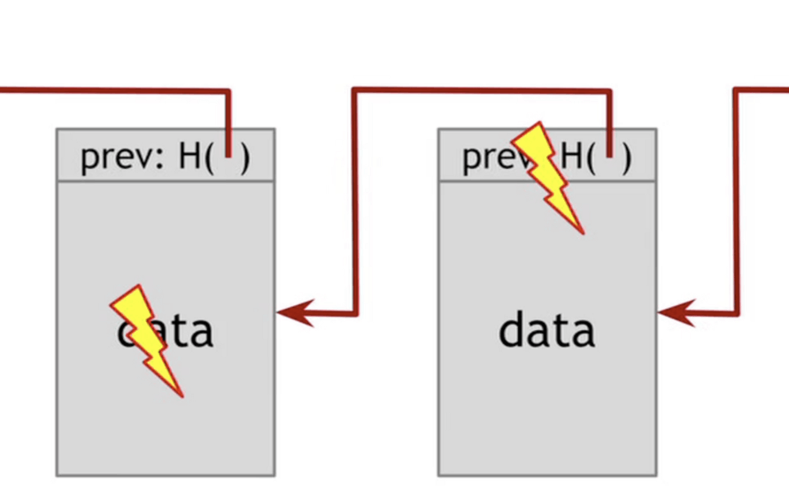
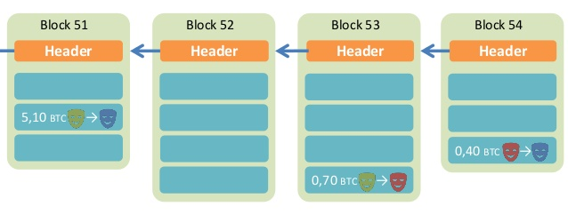

# 區塊鏈基礎知識

## 區塊鏈特性
去中心化： 
    沒有一個中心點管理帳本紀錄，而是每個參加區塊鏈的節點，都有同一本帳本，大家都會共同維護與更新，稱為分散式帳本，
     
    所以不像銀行 (中心化) 單一點掌控與管理帳本。
      
匿名性：區塊鏈的帳本，只會紀錄錢包地址 (英文 + 數字)，所以是不具名的，從區塊鏈帳本，是無法得知到，誰是擁有錢包地址的人。
      
不可竄改：一旦交易紀錄，寫進了區塊，任何其他單一節點，都無法更改這個事實，
     
    因為是去中心化，所以資料寫入成功後，是無法單一節點去修改，但如果有人掌握 51% 節點，大於整體的一半以上，
     
    就可以隨意修改資料、取消轉帳、自私挖礦、雙花攻擊等，被 51% 攻擊的鏈，就意味者是不安全的鏈。
      
共識：區塊鏈會用共識算法，來作為挖礦的機制，像是比特幣是用工作量證明，誰的運算力越高越快，就越大可能挖到幣。
      

## 區塊鏈 1.0、2.0、3.0
區塊鏈 1.0：以比特幣為代表性，在此時的時代，鏈都是提供加密貨幣的交易。
  
區塊鏈 2.0：以以太坊為代表性，在加密貨幣基礎上，讓鏈有圖靈完備特性，
 
就是像計算機一樣執行程式，更簡單說法，就是可執行智能合約。
  
區塊鏈 3.0：意指區塊鏈不只在金融領域使用，可擴展到其他領域，如身份認證、物流、醫療、投票等，
 
藉由區塊鏈的特性，解決其他領域的問題，這階段展開多元應用。

## 節點
區塊鏈是一個分佈式系統，是藉由每個節點連結成的，當中是用 P2P 技術連結與同步紀錄，
 
可以藉由節點來做交易、同步區塊資訊、挖礦等功能，在每個鏈設計上不同，
 
可能由一個節點覆蓋多個功能或是需要起不同功能的節點，如交易節點、錢包節點等。

 
全節點：擁有完整紀錄，包含區塊跟區塊內的交易紀錄，也稱為完整驗證節點，因為有參與驗證區塊交易事務是否符合共識規則，
 
全節點可用來做交易事務和區塊，來增加到區塊鏈上。
  
輕節點：因在加密貨幣錢包中，只是需要查詢區塊鏈上的數據，無需有完整節點紀錄，只有紀錄最小量的狀態 (區塊頭)，作為傳遞訊息使用，
 
輕節點是用來做通信端，因沒有任何鏈上詳細紀錄，需要透過網路到其他全節點取得完整紀錄，並輕節點是沒有參與驗證區塊交易事務的。

## 硬分叉、軟分叉
在區塊鏈還是有需要做升級的動作，而透過分叉來做更新區塊鏈，就是節點上的程式使用了新版本，而會跟其他節點運行的規則不一致，
 
新的節點跟舊的節點，就會獨立發展不同的同步訊息，所以就像是分叉了一樣，但隨者多個節點更新程式後，就又回到一致狀態。

 
硬分叉：是一種不支援向後相容的軟體升級方式，舊有節點無法參與新的共識機制。
  
軟分叉：是一種支援向後相容的軟體升級方式，舊有的節點可參與新的共識機制。

## 區塊鏈分叉
在區塊鏈上同步訊息，會因為網路延遲所產生的問題，區塊會因為不同時間到達節點，
 
這時會繼續產生下一個區塊的誕生與廣播，而礦工依照共識規則持續挖礦，每個節點只會信任最長的區塊，
 
因為網路延遲產生的問題，只會短時間分叉，藉由共識規則運行，最後只會保留最長的區塊，重新達到一致的帳本紀錄。

## 交易區塊確認數
因區塊鏈是每個節點有一份帳本紀錄，但每個節點同步資訊是需要時間的，為了避免分叉，
 
所以鏈設計上就依照最長的鏈為主，短的則會自動銷毀，像是 BTC 就需要有 6 個區塊確認數，
 
這是在鏈上設計的邏輯。

在每個交易所也都會在自訂，交易區塊確認數，是為了提高交易的資產在鏈上的安全性，
 
因為在鏈上較長的鏈，越不可能被攻擊，安全性越高，如交易所 BTC 確認數為 12 個區塊確認數，就大大提升安全性。

## 挖礦
工作量證明 (PoW)：是在比特幣開始使用的共識算法，PoW 來達成整個區塊鏈的共識，大家遵循 PoW 達成一致的帳本紀錄，
 
挖礦顧名思義就是產生新的區塊，藉由礦工將交易資訊放入區塊後，在廣播出去加入候選區塊，當候選區塊變成確認區塊，此交易就是為有效，
 
當礦工是需要有資格的，要求礦工用一些自有資源來換取挖礦的權利，這種資源就是用計算能力，來換取挖礦的能力。

 
權益機制證明 (PoS)：因 PoW 的計算能力，趨向於中心化，產生礦池並被少數人把持，並計算產生環保的問題，
 
在 PoS 稱為鍛造區塊，而不是挖礦區塊，要可以鍛造區塊，是需要鎖定一定數量的代幣作為質押來換取的，
 
質押的數量大小，決定了一個節點被選為鍛造下一個區塊的下一個驗證人的機會，質押越多機會越大，
 
為避免中心化，在選擇過程中加入，「隨機區塊選擇」、「代幣年齡選擇」。

## 冷熱錢包
冷錢包，指的是沒有網路連線的錢包，熱錢包，指的是隨時有網路連線的錢包，
 
在區塊鏈交易中，只有發送方，需要使用私鑰和網路，接收方請需要提供地址，無需連上網路，
 
所以冷錢包不是隨時連線網路，具有較高的安全性，並提供地址，就可一樣在區塊鏈上，做接收方持續交易。

## 智能合約
將程式邏輯寫入區塊鏈上，藉由區塊鏈運行程式，因儲存在鏈上，公開透明、不能更改的特性，
 
就無需第三方介入做仲裁，雙方不是信任對方，是信任智能合約的特性，並智能合約內容是自動執行的。

## 幣和代幣
幣：是指每個鏈上原生的加密貨幣，並只用來當作貨幣支付使用，如比特幣，每個幣發明都有自己的願景與明確目的，
 
如比特幣白皮書上寫的，「完全以端對端（peer-to-peer）技術實現的電子現金系統允許線上支付可以不必透過金融機構而直接從某一方傳送」。

 
代幣：除了可作支付以外，還可以做其他功能性的貨幣。
 
支付行代幣：主要是用來支付的代幣，如 USDT。
 
功能型代幣：提供用戶可使用產品或服務的訪問權。
 
資產行代幣：初創公司可透過 ICO 發行自己的代幣，可視為公司的資產權，這樣初創公司進入金融市場的門檻就大大降低。

## 水龍頭 Testnet Faucet
提供給測試網發送代幣，如 [BSC Faucet](https://testnet.binance.org/faucet-smart) ，
 
可藉由水龍頭發送 BNB、USDT 等代幣，提供開發人員測試使用。

## 區塊之間如何串連
區塊鏈顧名思義，就是一個一個區塊串接連起，每次交易時，就是建立新的區塊。

在區塊內分為區塊頭 (當前區塊特徵) 和區塊體 (實際數據)，在區塊頭包括生成時間、實際數據的哈希、上一個區塊的哈希。
 
所謂哈希就是，對任意內容計算出的長度相同數值，只要內容值不變，重新計算的哈希就是會是一樣，
 
藉由哈希，可以有兩點特徵，每個區塊的哈希是不一樣的，可以使用哈希來識別區塊，如果區塊內容改變，哈希值也一定會跟者改變。
  
哈希 = SHA256(區塊頭)，依照這個公式計算出哈希，「記得在區塊頭包含當前區塊體哈希和上一個區塊的哈希」，
 
這一點特徵有重大功能，因為如果要修改一個區塊，該區塊的哈希改變，為了讓後面區塊可以連到 (下一個區塊包含上一個區塊哈希)，
 
就必須依序修改後面所有的區塊，否則被修改過的區塊就會脫離區塊鏈，無法連接起來，並且運行哈希很耗時間，
 
短時間內要修改非常多個區塊，是不可能的，除非掌握了整個區塊鏈的 51% 計算能力。
  
正因為修改哈希，需同時修改後面區塊哈希，因有這個聯動機制，
 
區塊鏈才保證了數據的可靠性和不可竄改的能力，就像歷史一樣，發生了就無法在此改變。

參考：
 
[区块链入门教程](https://www.ruanyifeng.com/blog/2017/12/blockchain-tutorial.html)
 
[区块链原理](https://www.liaoxuefeng.com/wiki/1207298049439968/1311929706479649)

## ETH 1.0 區塊的欄位描敘
Block Height：此區塊在鏈上的第幾個區塊。
 
Timestamp：生成時間。
 
Transactions：此區塊內的交易數據。
 
Mined by：是那位礦工開採的。
 
Block Reward：區塊的獎勵，開採礦工獲得的獎勵。
 
Uncles Reward：叔叔區塊的獎勵，開採礦工獲得的獎勵。
 
&nbsp;&nbsp;&nbsp;&nbsp;&nbsp;&nbsp;&nbsp;&nbsp;&nbsp;&nbsp;&nbsp;&nbsp;&nbsp;
&nbsp;&nbsp;&nbsp;&nbsp;&nbsp;&nbsp;&nbsp;&nbsp;&nbsp;&nbsp;&nbsp;&nbsp;&nbsp;
因會有暫時性分叉，是合理場景，並且是合法的區塊，
 
&nbsp;&nbsp;&nbsp;&nbsp;&nbsp;&nbsp;&nbsp;&nbsp;&nbsp;&nbsp;&nbsp;&nbsp;&nbsp;
&nbsp;&nbsp;&nbsp;&nbsp;&nbsp;&nbsp;&nbsp;&nbsp;&nbsp;&nbsp;&nbsp;&nbsp;&nbsp;
只是因為共識機制，最後沒有納入最長的鏈內，ETH 還是獎勵開採叔塊的礦工。
 
Difficulty：開採的困難度，是此區塊的難度。
 
Total Difficulty：是全部鏈到這個區塊的總難度。
 
Size：此塊的大小。
 
Gas Used：該區塊中所有交易的總 gas 使用量。
 
Gas Limit：此塊中允許的最大氣體。
 
Extra Data：此塊的「額外數據」字段。

## ETH 1.0 交易的欄位描敘
Transaction Hash：此交易的哈希。
 
Status：交易的狀態，成功、失敗。
 
Block：此交易歸屬在那個區塊內的資料。
 
Timestamp：生成時間。
 
From：發送者地址。
 
To (一般交易)：接收者地址，當代幣交易時，此回傳 nil。
 
Interacted With (To) (代幣交易)：智能合約地址。
 
Tokens Transferred (代幣交易)：From 地址和 To 地址，代幣交易金額。
 
Value：一般交易的金額，當為代幣交易時，此處為 0。
 
Transaction Fee：交易的手續費，公式 Gas Price * Gas Used。
 
Gas Limit：發送者，提供此交易 gas 最大上限值。
 
Gas Used by Transaction：實際 gas 消耗數值。
 
Gas Price：發送者，支付的 gas 價格。
 
Nonce：此為流水數值，每次交易 Nonce 就會 +1，是通過計算一個地址的交易數量，如地址交易五筆，下個 Nonce 就會是 6。
 
&nbsp;&nbsp;&nbsp;&nbsp;&nbsp;&nbsp;&nbsp;&nbsp;&nbsp;&nbsp;&nbsp;&nbsp;&nbsp;
Nonce 可用來解決交易順序和防止重放攻擊，或交易 gas Limit 已達上限未交易城聰，可用同個 Nonce 在發起交易，修改 gas Limit 值。
 
Input Data：和交易一起發送的數據，一般交易此處為 0x 代表空陣列，代幣交易此處為程式 function 和 function 的參數。
